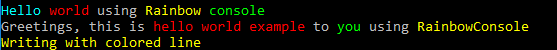

# ByteBit.RainbowConsole

Enrich System.Console with colors.

Great for use with String interpolation ($ sign).

## Examples

```csharp
static void Main( string[] args ) {
	var usingVariable = "Hello";
	Rainbow.Parse( $"{usingVariable:Cyan} {ConsoleColor.Red:world} using {ConsoleColor.Yellow:Rainbow} {ConsoleColor.Green:console}" ).RainbowWriteParsedText();

	Rainbow.RainbowWriteText( $"Greetings, this is {ConsoleColor.Red:hello world example} to {ConsoleColor.Green:you} using {nameof( ByteBit.RainbowConsole ):yellow}" );

	"Writing with colored line".ColoredLine( foregroundColor: ConsoleColor.Yellow );
}
```

Screenshot:



## Resources


### Icons

Used  icon from [Farm-Fresh Web](https://findicons.com/icon/164576/rainbow#) using [Creative Commons Attribution (by)](https://creativecommons.org/licenses/by/3.0/) licence.